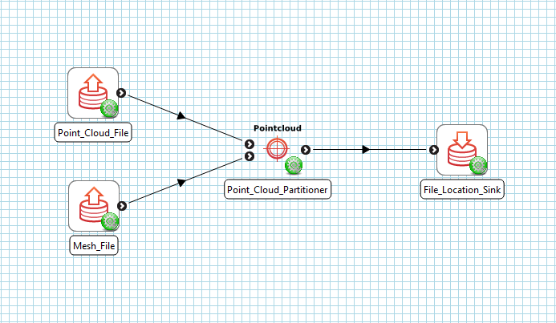
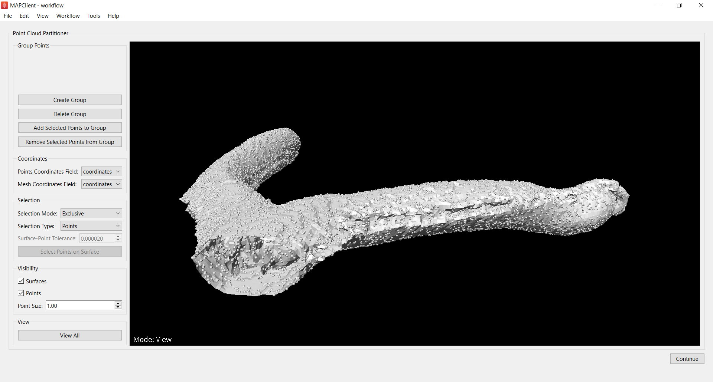
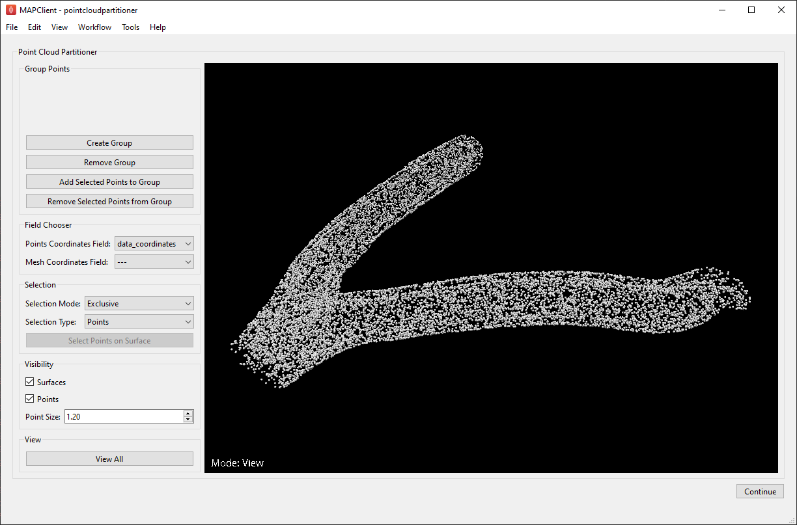
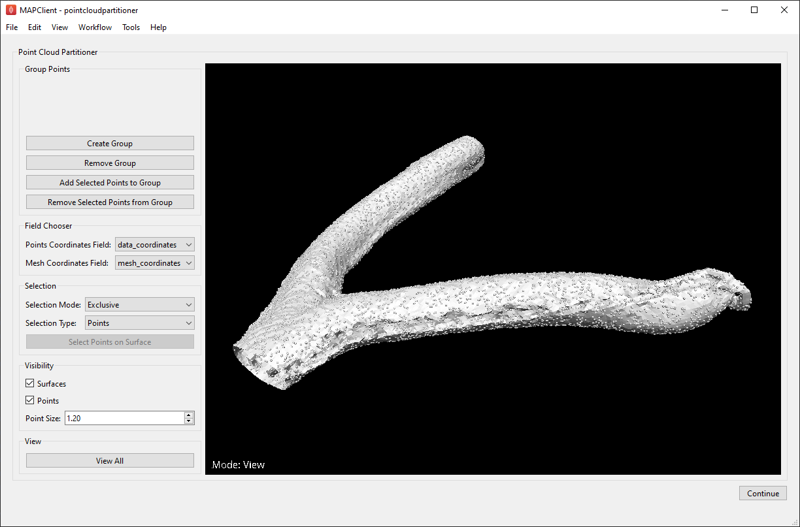
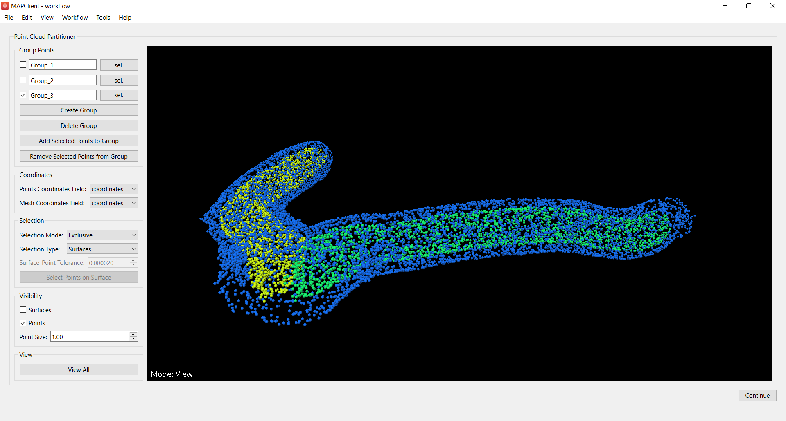
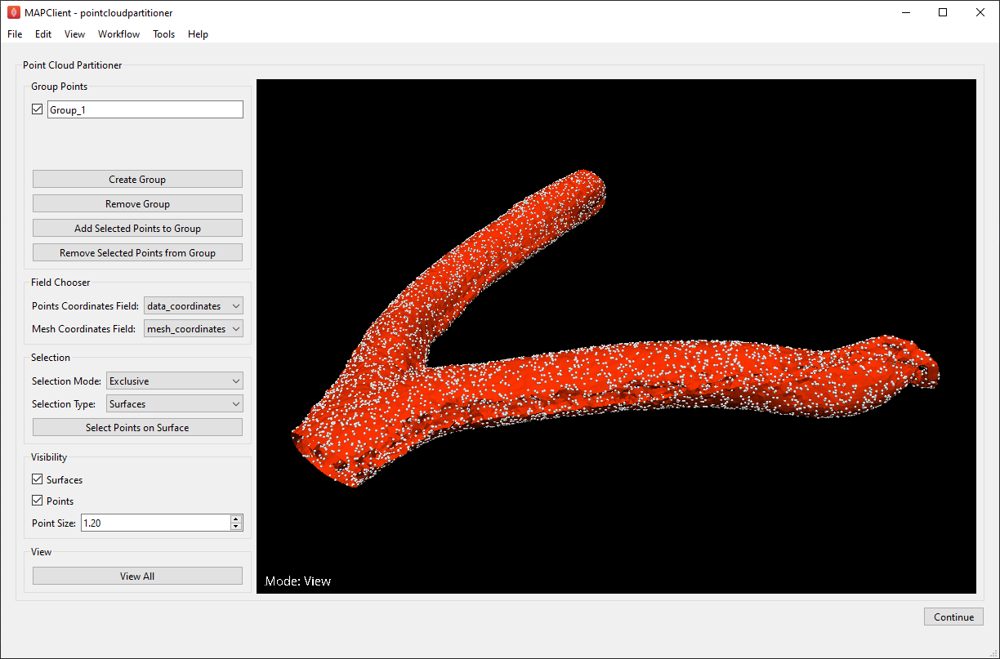

Point Cloud Partitioner Step
============================

Overview
--------

The **Point Cloud Partitioner** step is an interactive plugin for the MAP-Client.

This tool takes a `Zinc` compatible point-cloud EX file as an input and provides a GUI that gives the user a number of tools
to help separate these points into groups. The **Point Cloud Partitioner** step outputs another `Zinc` compatible EX file with the
points separated into groups defined by the user.

The **Point Cloud Partitioner** tool uses the `Zinc Widgets` library to provide graphical user interfaces for the underlying `Zinc` actions.

This document details the steps required to setup and use the **Point Cloud Partitioner** tool in the MAP-Client.

Workflow Connections
--------------------

The workflow connections for the **Point Cloud Partitioner** step are shown in :numref:`fig-point-cloud-partitioner-workflow`.

It takes a single input:

1. A `Zinc library` compatible EX file containing a point cloud.

`The partitioner tool will also read in any` Zinc `mesh objects contained in the input file. These mesh objects can be used
to help group the points. In` :numref:`fig-point-cloud-partitioner-workflow` `we have connected the` **Point Cloud Partitioner**
`input port to a` **File Chooser** `step, but any step that outputs a` Zinc `EX file could be connected to this port.`

The plugin provides a single output:

1. A `Zinc library` compatible EX file containing a point cloud with the points separated into named groups.

.. _fig-point-cloud-partitioner-workflow:

   **Point Cloud Partitioner** workflow connections.

Usage
-----

To setup a point cloud partitioner workflow, add a **File Chooser** step and a **Point Cloud Partitioner** step to the workflow area. Edit
the **File Chooser** step configuration to specify the `Zinc` EX file that contains the point cloud to be grouped. Once this step has been
configured, connect its output port to the input port of the **Point Cloud Partitioner** step - as in
:numref:`fig-point-cloud-partitioner-workflow`. The partitioner step will be configured by default as it doesn't have any configuration
settings to be set. What you connect the **Point Cloud Partitioner** step output port to depends on your objective. In
:numref:`fig-point-cloud-partitioner-workflow` we have connected the output port to a **File Location Sink** step - allowing us to define a
local directory where the output file will be saved.

Once we have the workflow set up, save it and click the `Execute` button to start the **Point Cloud Partitioner** GUI.

When the tool loads for the first time you should see something like the image displayed in :numref:`fig-point-cloud-partitioner-initial`.

.. _fig-point-cloud-partitioner-initial:

   **Point Cloud Partitioner** user interface just after loading.

Field Chooser
^^^^^^^^^^^^^

When the **Point Cloud Partitioner** GUI starts, the view area will initially be empty. To begin the grouping process we must first choose
which coordinate field should be used for the point-cloud data. Use the `Points Coordinate Field` combo box in the `Field Chooser` section
to choose the coordinate field that defines the coordinates of the point cloud. Once you have chosen a valid point coordinate field, the
point cloud data should be displayed in the view window as shown in :numref:`fig-point-cloud-partitioner-points`. If the points appear too
small or if they aren't initially visible, try increasing the `Point Size` value under the `Visibility` section.

.. _fig-point-cloud-partitioner-points:

   **Point Cloud Partitioner** after setting points coordinate field.

If your input EX file also contains a `Zinc` mesh, you can use the `Mesh Coordinate Field` combo box to select the coordinate field that
defines the coordinate data of the mesh. This will visualise the mesh in the view window, which will enable some additional selection
features that can help with the point grouping step. For more information about this see :ref:`selecting-points-on-surface`.

.. _fig-point-cloud-partitioner-mesh:

   **Point Cloud Partitioner** after setting mesh coordinate field.

Grouping Points
^^^^^^^^^^^^^^^

Once the point cloud data is visible, you are ready to start grouping points. To create a new point group click the `Create Group` button in
the `Group Points` section. This will add a check box and a label to the `Group Points` section of the GUI - as in
:numref:`fig-point-cloud-partitioner-points-grouped`. The group name defined in the label can be changed at any time and will be used to
name the group when it is written to the output file. Each point group is automatically assigned a display color.

The scene viewer currently has two modes: `View` and `Selection` - indicated by the text in the bottom left of the view window. `View` mode
is activated by default and allows the user to change the position of the scene items with the mouse. `Selection` mode can be activated by
holding the **S** key on the keyboard. The user can select a single point at a time or drag a selection box over all the points they wish to
select.

There are multiple different methods for selecting points in the scene - indicated by the `Selection Mode` combo box in the `Selection`
section. These include `Exclusive`, `Additive` and `Intersection`. `Exclusive` mode is selected by default and will clear all previously
selected points each time the user makes a new selection. `Additive` mode will add all selected points to the current selection each time
the user selects a new set of points. `Intersection` mode will select all points in the current selection box only if they were already
selected.

Once you have selected the points you wish to group, simply select the check box for the desired point group in the `Group Points` section
and click `Add Selected Points to Group`. Points can be removed from a group again by selecting them and clicking
`Remove Selected Points from Group`. If you wish to remove a point group entirely, select its check box and click `Remove Group`.

.. _fig-point-cloud-partitioner-points-grouped:

   **Point Cloud Partitioner** with points added to group.

.. _selecting-points-on-surface:

Selecting Points on Surface
^^^^^^^^^^^^^^^^^^^^^^^^^^^

If the input EX file defines a `Zinc` mesh, it is also possible to select all points that are positioned on the surface of that mesh. To
achieve this the user must first select the mesh surface that they wish to find points on. The graphics selection type can be changed with
the `Selection Type` combo box. Picking a mesh with a click or by dragging a selection box over part of it should highlight its
entire surface as shown in :numref:`fig-point-cloud-partitioner-surface-selection`.

.. _fig-point-cloud-partitioner-surface-selection:

   **Point Cloud Partitioner** with mesh surface selected.

Once the desired mesh surface has been selected, click `Select Points on Surface` to select all points positioned on the mesh. Note that
this button will be disabled if there is no mesh currently selected.

The `Select Points on Surface` action can also be used in tandem with `Intersection` selection mode - in the case that the user wishes to
select all points in the selection box only if they belong on a specific mesh surface. First select all points on the surface with the
`Select Points on Surface` action, then change the `Selection Mode` to `Intersection` and drag a selection box over the subset of points
that you wish to remain selected.

.. _fig-point-cloud-partitioner-surface-points:

.. figure:: _images/point-cloud-partitioner-surface-points.png
   :figwidth: 100%
   :align: center

   **Point Cloud Partitioner** with mesh surface selected.

Finishing
^^^^^^^^^

Clicking the `Continue` button will output the point cloud along with its groups to `Zinc` EX file and will execute any additional workflow
steps connected to the **Point Cloud Partitioner** step. The point groups will be labeled in the output file with the names defined in the
`Group Points` section of the GUI.
