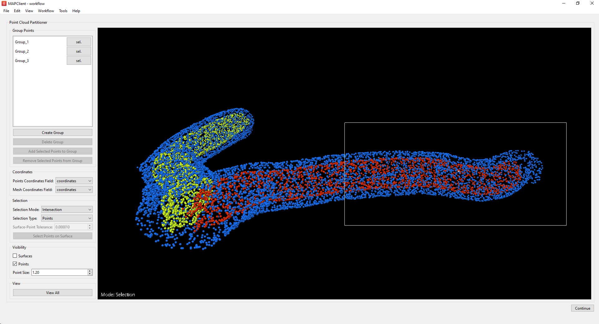

Point Cloud Partitioner Step
============================

Overview
--------

The **Point Cloud Partitioner** step is an interactive plugin for the MAP-Client.

This tool takes a `Zinc` compatible point-cloud EX file as an input and provides a GUI that gives the user a number of tools
to help separate these points into groups. The **Point Cloud Partitioner** step outputs another `Zinc` compatible EX file with the
points separated into groups defined by the user.

Specification
-------------

Information on this plugin's specifications is available :ref:`here <mcp-pointcloudpartitioner-specification>`.

Configuration
-------------

Information on this plugin's configuration is available :ref:`here <mcp-pointcloudpartitioner-configuration>`.

Workflow Setup
--------------

Information on setting up a workflow with this plugin can be found :ref:`here <mcp-pointcloudpartitioner-workflow-setup>`.

Instructions
------------

When the tool loads for the first time you should see something like the image displayed in :numref:`fig-point-cloud-partitioner-initial`.

.. _fig-point-cloud-partitioner-initial:

.. figure:: _images/point-cloud-partitioner-initial.png
   :figwidth: 100%
   :align: center

   **Point Cloud Partitioner** user interface just after loading.

The coordinate fields used for the point-cloud and mesh data are determined automatically but can be changed using the combo-boxes in the
`Coordinates` section if required.

If the points appear too small or if they aren't initially visible, try increasing the `Point Size` value under the `Visibility` section.

Selection
^^^^^^^^^

The scene viewer currently has two modes: `View` and `Selection` - indicated by the text in the bottom left of the view window. `View` mode
is activated by default and allows the user to change the position of the scene items with the mouse. `Selection` mode can be activated by
holding the **S** key on the keyboard. The user can select a single point at a time or drag a selection box over all the points they wish to
select.

There are multiple different methods for selecting points in the scene - indicated by the `Selection Mode` combo box in the `Selection`
section. These modes include `Exclusive`, `Additive` and `Intersection`. `Exclusive` mode is selected by default and will clear all
previously selected points each time the user makes a new selection. `Additive` mode will add all selected points to the current selection
each time the user selects a new set of points. `Intersection` mode will select all points in the current selection box only if they were
already selected.

See :ref:`advanced-selection` for information on: selecting points associated with a specific mesh surface, and separating point groups into
subsets.

Grouping Points
^^^^^^^^^^^^^^^

To create a new point group click the `Create Group` button in the `Group Points` section. This will add a check box and a label to the
`Group Points` section of the GUI, as well as a `sel.` button to select all points already assigned to that group.
The group name defined in the label can be changed at any time and will be used to identify the group when
it is written to the output file. Each point group is automatically assigned a display color.

Once you have selected the points you wish to group, simply select the check box for the desired point group in the `Group Points` section
and click `Add Selected Points to Group`. Points can be removed from a group again by selecting them and clicking
`Remove Selected Points from Group`. If you wish to remove a point group entirely, select its check box and click `Remove Group`.

.. _advanced-selection:

Advanced Selection
^^^^^^^^^^^^^^^^^^

This section describes how to select and group all points associated with a given mesh surface, as well as how the user can partition a
group of points into smaller subsets.

If the plugin additionally imports a `Zinc` mesh, it is possible to select all points that are positioned on the surface of that mesh. To
achieve this, change the `Selection Type` to `Surfaces` and select the mesh surface that you wish to find points on. Picking a mesh with a
click or by dragging a selection box over part of it should highlight its entire surface as shown with one of the inner mesh surfaces in
:numref:`fig-point-cloud-partitioner-surface-selection`.

.. _fig-point-cloud-partitioner-surface-selection:

.. figure:: _images/point-cloud-partitioner-surface-selection.png
   :figwidth: 100%
   :align: center

   **Point Cloud Partitioner** with a mesh surface selected.

Once the desired mesh surface has been selected, click `Select Points on Surface` under the `Selection` section to select all points
positioned on the mesh surface. Note that this button will be disabled if there is no mesh currently selected. The `Surface-Point Tolerance`
spin-box determines how close a point has to be to a surface to be selected by this process - by default the tolerance value is set to
0.00001. :numref:`fig-point-cloud-partitioner-surface-points` illustrates what the scene should look like once this process has completed.
Note that the surfaces visibility has been disabled.

.. _fig-point-cloud-partitioner-surface-points:

.. figure:: _images/point-cloud-partitioner-surface-points.png
   :figwidth: 100%
   :align: center

   **Point Cloud Partitioner** with mesh surface selected.

Using these steps the user can separate the point-cloud into distinct groups corresponding with the surfaces of the mesh input as in
:numref:`fig-point-cloud-partitioner-points-grouped`:

.. _fig-point-cloud-partitioner-points-grouped:

.. figure:: _images/point-cloud-partitioner-points-grouped.png
   :figwidth: 100%
   :align: center

   **Point Cloud Partitioner** with points separated into mesh surface groups.

Finally, the `Intersection` selection mode can be used on an existing selection if the user wishes to separate a group of points into
subsets.

Continuing from the previous step, you can select all points in an existing group by pressing the group's associated `sel.` button. Once
you have selected the group of points you want to partition, change the `Selection Mode` to `Intersection` and drag a selection box over
only the subset of points you wish to remain selected:

.. _fig-point-cloud-partitioner-selecting:

   **Point Cloud Partitioner** with points separated into mesh surface groups.

These points can then be assigned to a new point group as usual, or further partitioned into subsets.

Finishing
^^^^^^^^^

Clicking the `Continue` button will output the point cloud along with its groups to `Zinc` EX file and will execute any additional workflow
steps connected to the **Point Cloud Partitioner** step. The point groups will be labeled in the output file with the names defined in the
`Group Points` section of the GUI.
